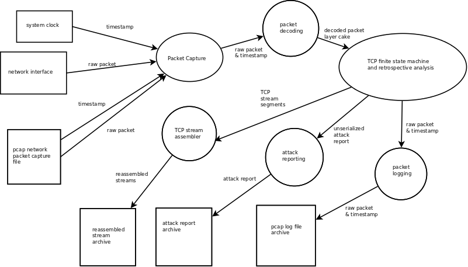

HoneyBadger
===========

| 
.. image:: https://drone.io/github.com/david415/HoneyBadger/status.png
  :target: https://drone.io/github.com/david415/HoneyBadger/latest

.. image:: https://coveralls.io/repos/david415/HoneyBadger/badge.svg?branch=master
  :target: https://coveralls.io/r/david415/HoneyBadger?branch=master 

.. image:: https://api.flattr.com/button/flattr-badge-large.png
  :target: https://flattr.com/submit/auto?user_id=david415&url=https%3A%2F%2Fgithub.com%2Fdavid415%2FHoneyBadger
|

**TCP attack inquisitor and 0-day catcher.**

- HoneyBadger is primarily a comprehensive TCP stream analysis tool for detecting and recording TCP attacks.
- HoneyBadger is modern software written in Golang to deal with TCP's very olde injection vulnerabilities.
- HoneyBadger includes a variety of TCP stream injection attacks written in golang. (2 so far)
- Free as in GPLv3 (except for small sections of Google's BSD licensed code) and the source code is available on github:

* https://github.com/david415/HoneyBadger

what does HoneyBadger do and **not** do?
----------------------------------------

**DO**

- one purpose in life... To detect (and optionally record) TCP injection attacks and attempts.

- passively analyze TCP traffic

**NOT DO**

- HoneyBadger is in fact not a "honey pot"

- HoneyBadger does not send packets

- HoneyBadger does not detect man-in-the-middle attacks

- HoneyBadger does not determine if an attack attempt was successful (I suspect that in the wild TCP attacks will have differing TTLs and other clues that will help us determine if the attack was successful or not)

- HoneyBadger is nothing like the more general purpose tools like Snort, Bro or Wireshark.

installation
------------

Before building and installing honeybadger I suggest building a modern version of golang from source as described in the instructions here:

https://golang.org/doc/install/source

Like this::

  cd $HOME
  git clone https://go.googlesource.com/go
  cd go
  git checkout go1.4.2
  cd src
  ./make.bash

Setup the golang environment variables::

  export GOPATH=$HOME/go/gopath
  export PATH=$PATH:$HOME/go/bin:$HOME/go/gopath/bin

Then after that you can build honeybadger and it's dependencies like this::

  cd $HOME/go
  mkdir -p gopath/src/github.com/google
  cd gopath/src/github.com/google
  git clone https://github.com/google/gopacket.git
  mkdir -p $HOME/go/gopath/src/github.com/david415
  cd $HOME/go/gopath/src/github.com/david415
  git clone https://github.com/david415/HoneyBadger.git
  cd HoneyBadger/cmd/honeyBadger
  go build

preparing to run HoneyBadger
----------------------------

If you run Linux and would like to use the AF_PACKET sniffer then you should
also disable the segment offloading options on the relavent network device(s) ::

  ethtool -K eth0 gso off
  ethtool -K eth0 tso off
  ethtool -K eth0 gro off

Linux users should run honeyBadger as an unprivileged user. First run setcap as root like so::

  setcap cap_net_raw,cap_net_admin=eip honeyBadger

Tor exit relay operator legal considerations
--------------------------------------------

- Telecommunications laws in your Tor exit relay country may prohibit recording user's content without their consent. HoneyBadger therefore does not record packets (pcap log) by default; and attack reports only record metadata. IP addresses and TCP ports are recorded in the attack metadata reports... this sensitive data should be anonymized before making it public.

- As far as my humble legal-system understanding is concerned it should be legal to operate an opt-in HoneyBadger service for users who consent to having their traffic recorded.

- It is the author's firm belief that it is definitely legal to monitor your own traffic using HoneyBadger with the full-take logging features.

how to sniff only your own traffic on a Tor exit you control
------------------------------------------------------------

Soon I'd like to write more here about various ways that you can isolate your own traffic on a Tor exit relay you control. Here's one such idea:

Client -> localsocks-proxy -> tor connection -> tor exit -> tor-exit-socks-proxy-server-> internet

However... Firefox/TBB currently does not support Socks Proxy username/password authentication... so we should probably use a different tactic to isolate our traffic?

what to do with HoneyBadger collected data
------------------------------------------

We expect HoneyBadger to have various false positive bugs... and furthermore there are in fact various ways in which network anomalies can appear to be injection attacks or accidentally inject data. I have seen in the wild misbehaving load balancers etc.

If your honeybadger generates an attack report and you have specified the CLI option `-metadata_attack_log=false` then you may be interested in the `honeybadgerReportTool`; it displays a dump output which includes ASCII and hex... this color coated hex diff makes it **very** obvious what data was injected. This simple utility is located in the honeybadger code repo here: https://github.com/david415/HoneyBadger/blob/master/cmd/honeybadgerReportTool/main.go

honeyBadger commandline arguments and usage
-------------------------------------------

honeyBadger has a rather large commandline usage... but it's not very difficult::

 $ ./honeyBadger --help
 Usage of ./honeyBadger:
  -connection_max_buffer=0: 
 Max packets to buffer for a single connection before skipping over a gap in data
 and continuing to stream the connection after the buffer.  If zero or less, this
 is infinite.
  -detect_coalesce_injection=true: Detect coalesce injection attacks
  -detect_hijack=true: Detect handshake hijack attacks
  -detect_injection=true: Detect injection attacks
  -f="tcp": BPF filter for pcap
  -i="eth0": Interface to get packets from
  -l="honeyBadger-logs": log directory
  -log_packets=false: if set to true then log all packets for each tracked TCP connection
  -max_concurrent_connections=0: Maximum number of concurrent connection to track.
  -max_ring_packets=40: Max packets per connection stream ring buffer
  -metadata_attack_log=true: if set to true then attack reports will only include metadata
  -s=65536: SnapLen for pcap packet capture
  -tcp_idle_timeout=5m0s: tcp idle timeout duration
  -total_max_buffer=0: 
 Max packets to buffer total before skipping over gaps in connections and
 continuing to stream connection data.  If zero or less, this is infinite
  -w="3s": timeout for reading packets off the wire

  
my remarks about each of these options:

- **packet capture options:** Options '-f' and '-i' are used to determine which packets to pay attention to. Currently honeybadger only supports sniffing one network interface. We've got plans to remove the libpcap dependency so in that case the '-f' filter argument would go away. '-w' and '-s' are relevant here, you probably want to use the default options.
  
- **logging options:** you must specify a logging directory using '-l'. pcap logging is off by default. If you set -log_packets= to true then honeybadger will write one pcap file per connection. Upon connection close honeybadger will delete the pcap logfile unless a TCP attack was detected. **warning**: this will cause lots of filesystem churn when sniffing high traffic interfaces. If you are using Linux then I suggest turning off swap and using a reasonably sized tmpfs for the logs directory. By default honeybadger write metadata-only logs which will NOT contain any packet payload data but will have various sensitive information about attack attempts such as: source and destination IP addresses and TCP ports, the type of TCP injection attack (there are several), time of the attack, TCP Sequence number boundaries of the injection. If you set -metadata_attack_log=false then honeybadger will log the attack packet payload AND the stream overlap.

- **resource boundary options:** '-connection_max_buffer' and '-total_max_buffer' are used to limit the amount of page-cache pages that honeybadger can use for storing and reordering out-of-order-packets (much like TCP's mbuf datastructure). '-tcp_idle_timeout' is important as a stop-gap measure to prevent us from tracking connections that may have been closed without our knowing. '-max_ring_packets' is very important to set appropriately; it determines the size of the TCP reassembly ring buffer. This ring buffer is utilized for the retrospective analysis that allows us to determine if a given packet overlaps with previously reassembled stream segments. I estimate that this ring buffer should be set to a size that is roughly equivalent to the TCP window size of the connection... but maybe someone can help us pick a better heuristic? I usually set it to 40 and it works OK.

data flow
---------

HoneyBadger passively reads packets off a network interface or a pcap file and if detection is triggered writes
TCP attack reports, pcap packet log files and reasembled TCP streams.

Here's a data flow diagram that gives the basic idea of passively sniffing:

| 

autogenerated API documentation
-------------------------------
https://godoc.org/github.com/david415/HoneyBadger

manual "integration test" with netcat
=====================================

abstract
--------

This manual testing procedure proves that HoneyBadger's TCP injection detection is solid!
It only takes a few minutes to perform... and thus I highly recommend it to new users for
two reasons

1. to raise awareness about how insecure TCP is

2. to give you confidence that HoneyBadger has reliable TCP attack detection functionality

procedure
---------

1. build ``honeyBadger`` and ``sprayInjector`` (located under the ``cmd`` directory in the source repository) and (if you don't want to run them as root) run ``setcat`` to set capabilities on the binaries (eg, ``setcap cap_net_raw,cap_net_admin=eip honeyBadger`` as root).

2. run ``honeyBadger`` with these arguments... Note we are telling honeyBadger to write log files to the current working directory.

.. code-block:: bash

   ./honeyBadger -i=lo -f="tcp port 9666" -l="." -total_max_buffer=300 -connection_max_buffer=100

3. run ``sprayInjector`` with these arguments

.. code-block:: bash

   ./sprayInjector -d=127.0.0.1 -e=9666 -f="tcp" -i=lo

4. start the netcat server

.. code-block:: bash

   nc -l -p 9666

5. start the netcat client

.. code-block:: bash

   nc 127.0.0.1 9666

6. In this next step we enter some data on the netcat server so that it will send it to the netcat client that is connected until the sprayInjector prints a log message containing "packet spray sent!" In that cause the TCP connection will have been sloppily injected. The injected data should be visible in the netcat client's output.

7. Look for the log files in honeyBadger's working directory. You should see two files beginning with "127.0.0.1"; the pcap file is a full packet log of that TCP connection which you can easily view in Wireshark et al. The JSON file contains attack reports. This is various peices of information relevant to each TCP injection attack. The ``sprayInjector`` tends to produce several injections... and does so sloppily in regards to keeping the client and server synchronized.

.. code-block:: none

   $ ls 127*
  127.0.0.1:43716-127.0.0.1:9666.pcap  127.0.0.1:9666-127.0.0.1:43716.attackreport.json

It's what you'd expect... the pcap file can be viewed and analyzed in Wireshark and other similar tools.
The *127.0.0.1:9666-127.0.0.1:43716.attackreport.json* file contains JSON report structures.
The attack reports contains important information that is highly relevant to your interests such as::

* type of TCP injection attack
* flow of attack (meaning srcip:srcport-dstip:dstport)
* time of attack
* payload of packet with overlaping stream segment (in base64 format)
* previously assembled stream segment that overlaps with packet payload (in base64 format)
* TCP sequence of packet
* end sequence of packet
* overlap start offset is the number of bytes from the beginning of the packet payload that we have available among the reassembled stream segments for retrospective analysis
* overlap end offset is the number of bytes from the end of the packet payload that we have in our reassembled stream segments...

https://godoc.org/github.com/david415/HoneyBadger#AttackReport

::

    $ cat 127.0.0.1:9666-127.0.0.1:43716.attackreport.json
    {"Type":"injection","Flow":"127.0.0.1:9666-127.0.0.1:43716","Time":"2015-01-30T08:38:14.378603859Z","Payload":"bWVvd21lb3dtZW93","Overlap":"aHJzCg==","StartSequence":831278445,"EndSequence":831278456,"OverlapStart":0,"OverlapEnd":4}
    {"Type":"injection","Flow":"127.0.0.1:9666-127.0.0.1:43716","Time":"2015-01-30T08:38:14.379005763Z","Payload":"bWVvd21lb3dtZW93","Overlap":"cnMK","StartSequence":831278446,"EndSequence":831278457,"OverlapStart":0,"OverlapEnd":3}
    ...

|
|
|

| 
